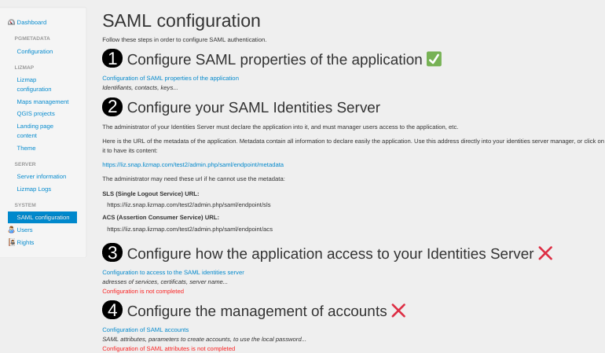
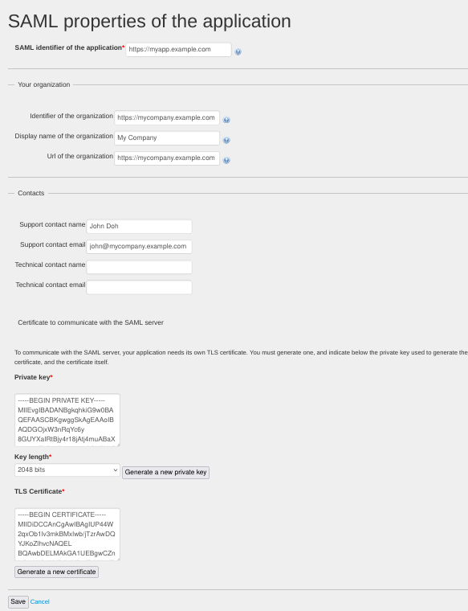
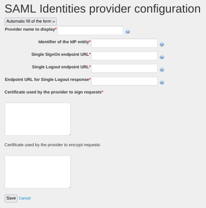
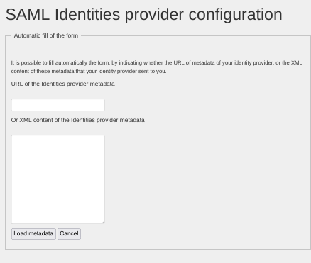
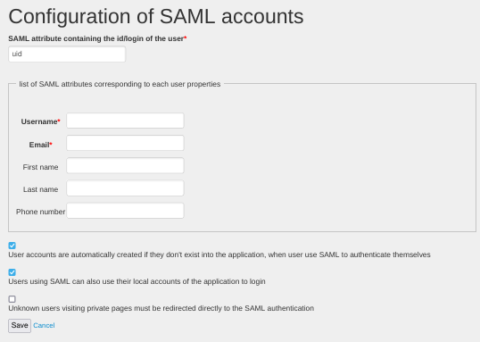

Configuration
=============

There are two modules, "saml" and "samladmin". The first provides all the
authentication feature using the SAML protocol, and the second provides
a user interface to configure the first one.

When "samladmin" is installed, you should have into your application
a menu item named "SAML configuration". Here is the main page of the configurator.



There are four steps to configure the SAML authentication

1. You setup the application name and TLS certificates of the application



2. You configure your identity server in order to declare the application

It could be Microsoft Azure Active Directory, LemonLdap or any identity server
that supports SAML.

You'll have probably to give the content or the url of the SAML metadata of
the application, or some other URL like ACS url etc. There are displayed
on the main page of the configurator.

3. You retrieve metadata provided by your identity server, and then you
   can declare the identity server into the application.



Here you can fill by hand all URL that allow the application to communicate
with the SAML server, or you can give the content of the metatada given
by the identity server.




For Microsoft Azure Active Directory, you'll have to give some URL like these,
where `<UUID-MICROSOFT-ACCOUNT>` is replaced by a random number:

- Identifier of the IdP entity: `https://sts.windows.net/<UUID-MICROSOFT-ACCOUNT>/`
- Single SignOn endpoint URL: `https://login.microsoftonline.com/<UUID-MICROSOFT-ACCOUNT>/saml2`
- Single Logout endpoint URL: `https://login.microsoftonline.com/<UUID-MICROSOFT-ACCOUNT>/saml2`
- Endpoint URL for Single Logout response: `https://login.microsoftonline.com/<UUID-MICROSOFT-ACCOUNT>/saml2`


4. You configure the SAML accounts into the application, and some behaviors
   of the SAML authentication.

When a user is authenticated, your identity server gives to the application some
informations about the user into some "SAML attributes": identifier, email,
firstname, lastname etc.. You should indicate what are the name of these attributes,
so the saml module could match authenticated users with application accounts.



Attribute names are often some URL. For Microsoft Azure Active Directory,
you certainly have to give these values:

- SAML attribute containing the id/login of the user: `http://schemas.xmlsoap.org/ws/2005/05/identity/claims/name`
- Username: `http://schemas.xmlsoap.org/ws/2005/05/identity/claims/name`
- Email: `http://schemas.xmlsoap.org/ws/2005/05/identity/claims/emailaddress`
- First name: `http://schemas.xmlsoap.org/ws/2005/05/identity/claims/givenname`
- Last name: `http://schemas.xmlsoap.org/ws/2005/05/identity/claims/surname`

You can also activate the fact that SAML provides user groups through an attribute.


Configuration without samladmin
===============================

This section explain the configuration if you do not plan to install the
samladmin module.

You should setup parameters into `var/config/saml/saml.coord.ini.php`, and
mainly into `var/config/mainconfig.ini.php` or `var/config/localconfig.ini.php`,
into all `saml:*` sections.

To understand parameters into `saml:idp` and `saml:security`, see
the [README.md file of php-saml](https://github.com/onelogin/php-saml/blob/3.4.1/README.md).


Certificates
------------

With the samladmin module, you can generate a private key and a certificate from a web interface.

If you don't activate this module, you should put your service provider certificate
and private key into respectively `var/config/saml/certs/sp.crt` and `var/config/saml/certs/sp.key`.

An example to create the certificate (only for tests, you probably have to generate
them against an external or internal certificates authority)

```
openssl req -x509 -newkey rsa:4096 -keyout var/config/saml/certs/sp.key -out var/config/saml/certs/sp.crt -days 365 -nodes -subj "/C=FR/ST=France/L=Paris/O=jelix/OU=tests/CN=samltest.jelix.org"
```

If you plan to update the certificate and private key you can save a new
x509cert into `var/config/saml/certs/sp_new.crt` and it will be published on the
SP metadata so Identity Providers can read them and get ready for rollover.

Attributes
----------

The SAML Identity Provider will give you them some attributes about the user.
If not, you should configure the Identity Provider so it will include some
attributes into the login response.

With the samladmin module, you can setup easily the mapping between SAML attributes
and the user dao record properties.

If you don't use the samladmin module, you should setup by hand.

There should be at least one attribute, indicating the user login. You should
indicate the name of this attribute into the `__login` option of the `saml:attributes-mapping`
section of the configuration. In this example, the login value is given into
the `uid` attribute given by the Identity Provider:

```ini
[saml:attributes-mapping]
__login=uid
```

In the same section you can list the list of the user dao record properties that
will receive the values of some SAML attributes. Keys are property names, values
are attributes names.

```ini
[saml:attributes-mapping]
__login=uid

login=uid
email=mail

```

Here, the user dao object will have its `login` property receiving the value
of the `uid` attribute, and the  `email` property receiving the value
of the `mail` attribute.
